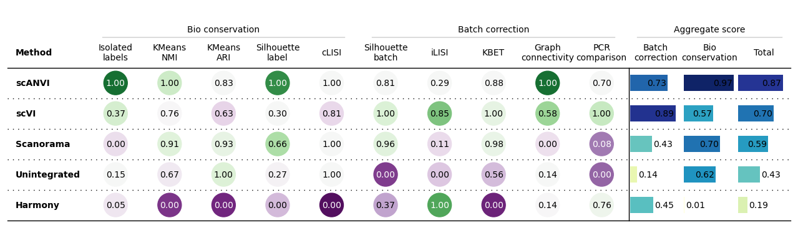

# **Mouse Atlas Project**
This repository contains scripts used for creating a Mouse Atlas by integrating datasets from the small and large intestines.

## **Files and Scripts**
**Mouse Atlas Data Mining.xlsx**: Lists all datasets to be integrated for the Atlas.

**Individual_datasets_analysis.Rmd**: Contains scripts for quality control and annotation of each dataset.

## **Integration Methods**
Various integration methods have been evaluated:

[Scanvi](https://docs.scvi-tools.org/en/stable/user_guide/models/scanvi.html), [Scanorama](https://github.com/brianhie/scanorama) and [scVI](https://docs.scvi-tools.org/en/stable/user_guide/models/scanvi.html) are recommended for more complex integrations while [Harmony](https://github.com/immunogenomics/harmony) works fine for more simple ones.
Refer to the benchmark paper for more details: Luecken, M.D., Büttner, M., Chaichoompu, K. et al. Benchmarking atlas-level data integration in single-cell genomics. Nat Methods 19, 41–50 (2022). DOI: 10.1038/s41592-021-01336-8

For performance comparison of methods, see: **Scib_integration_tests.ipynb**

## **Results**
For integration of datasets obtained from the Large Intestine Scanvi performed best overall, followed by Scanorama.

When additional two datasets from the small intestine were added:
Scanvi remained the best, while Scanorama dropped to third place. Harmony was effective with standard parameters but less so with the small intestine datasets. Further tuning was needed.

